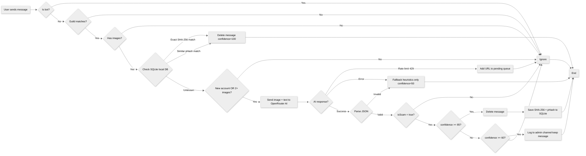

# AegisChat

Open-source Discord bot for real-time scam detection using hybrid analysis (heuristic rules + OpenRouter AI).

## Requirements

- [Node.js](https://nodejs.org) >= 18 installed
- A Discord Bot Token with **Message Content Intent** enabled
- An [OpenRouter](https://openrouter.ai) account

## Installation

```bash
git clone https://github.com/Ruimmp/AegisChat.git
cd AegisChat
npm install
```

## Configuration

1. Copy `.env.example` to `.env`
2. Fill in your values:

```env
# Discord
DISCORD_BOT_TOKEN=your_discord_bot_token_here
GUILD_ID=your_guild_id_here
LOG_CHANNEL_ID=your_log_channel_id_here

# OpenRouter (AI)
OPENROUTER_API_KEY=your_openrouter_api_key_here
OPENROUTER_MODEL=openrouter/free

# Detection thresholds
CONFIDENCE_THRESHOLD=85
REVIEW_THRESHOLD=60
PHASH_THRESHOLD=14

# Logging
LOG_LEVEL=info

# Storage (optional, defaults to aegis.db in the project root)
DB_PATH=
```

## Discord Bot Setup

1. Go to [Discord Developer Portal](https://discord.com/developers/applications)
2. Create a new application, then go to the "Bot" tab
3. Create a bot and copy the token
4. Enable **Message Content Intent** under the Bot tab
5. Invite the bot to your server with the following permissions:
   - **View Channels**
   - **Read Message History**
   - **Send Messages**
   - **Embed Links**
   - **Manage Messages**

## OpenRouter API Setup (Free)

1. Sign up at [openrouter.ai](https://openrouter.ai)
2. Go to Keys and generate an API key
3. Paste it into `.env` as `OPENROUTER_API_KEY`
4. Use `OPENROUTER_MODEL=openrouter/free` to automatically route to available free models that support the required features (text, image understanding, etc.). You can also use specific free models if preferred. See [OpenRouter Free Models](https://openrouter.ai/models?order=top_gpus&q=free) for options.

## How It Works

Text-only messages are never analyzed and never cost a token: the bot only looks at messages that include image attachments, since that is where this kind of scam actually lives.

- **Layer 1 - Local DB check**: every image attachment is checked against the local SQLite database first, by exact SHA-256 hash and by perceptual hash (pHash) similarity. A match deletes the message instantly at zero AI cost. See [Local Scam Image Database](#local-scam-image-database).
- **Layer 2 - AI escalation**: unrecognized images only reach OpenRouter when there is an actual risk signal, either the author's account is newer than 30 days, or the message carries 2 or more images at once (the common "proof screenshot" pattern for this kind of scam). A single image from an established account is skipped entirely, so normal chat activity (including keyword-heavy servers, e.g. crypto communities) never burns tokens.
- **Layer 3 - Action**:
  - Clear scams (high confidence + delete action): message is silently deleted.
  - Ambiguous scams (medium confidence): message is kept, but logged to the admin channel for manual review.



## Running the Bot

Development (with auto-restart on file change):

```bash
npm run dev
```

Production:

```bash
npm run start
```

## Confidence Thresholds

- `CONFIDENCE_THRESHOLD` (default: 85): Messages above this confidence with delete action are deleted automatically.
- `REVIEW_THRESHOLD` (default: 60): Messages between this and `CONFIDENCE_THRESHOLD` are logged to the admin channel for manual review but are NOT deleted.
- `PHASH_THRESHOLD` (default: 14): Max Hamming distance (0-64) for two images to be considered the same scam image. Lower = stricter matching (more AI calls), higher = looser matching (more cache hits, small risk of false-positive matches). See [Local Scam Image Database](#local-scam-image-database).

## Logging

Set `LOG_LEVEL` in `.env` to control console output:

- `debug`: all logs
- `info`: info, warn, error (default)
- `warn`: warn, error only
- `error`: errors only

## Local Scam Image Database

To reduce API calls and avoid rate limits, AegisChat uses a local SQLite database ([`better-sqlite3`](https://github.com/WiseLibs/better-sqlite3)) with WAL mode for durability. On hosts where the app folder doesn't persist between redeploys, point `DB_PATH` at a directory that does, otherwise the local scam-image cache resets every time. The database stores:

- `scam_images`: SHA-256 hash + perceptual hash (pHash) of confirmed scam images
- `pending_queue`: images waiting for AI analysis when rate-limited

**How it works:**

1. First time a new scam image is detected, the AI analyzes it and both its SHA-256 hash and perceptual hash (pHash) are saved in SQLite.
2. Future messages are checked against the local DB in two steps before ever calling the AI:
   - **Exact match**: SHA-256 hash lookup (byte-for-byte identical file).
   - **Similarity match**: perceptual hash (dHash) compared via Hamming distance against every stored image. Scammers rarely repost the exact same file, since they recompress, resize, or slightly crop it, so the exact hash alone misses most reposts. The perceptual hash catches these near-duplicates (distance ≤ `PHASH_THRESHOLD`) without needing the AI again.
3. If either check matches, the message is deleted immediately with confidence 100 and no AI call is made.
4. If OpenRouter is rate-limited, image URLs are queued in SQLite and retried every 5 minutes automatically.
5. Once the AI recovers and confirms a queued image as scam, it is added to the local database (both hashes) for instant future blocking.

### Pre-seeding known scam images

The bot ships with a `seed-images/` folder containing confirmed scam samples, so a fresh install already has a starting local database instead of needing the AI to (re)learn every scam from scratch. Drop your own confirmed scam images in there and they'll be hashed and added to the local database automatically, without ever calling the AI.

- Runs automatically every time the bot starts (safe to run repeatedly, duplicates are skipped).
- Can also be run standalone: `npm run seed`.
- Override the folder with `SEED_IMAGES_DIR=/path/to/images` (useful if you'd rather keep your own samples out of git).

Perceptual hashing is computed with [`sharp`](https://sharp.pixelplumbing.com/) (image resize/grayscale).

**Note on the perceptual hash**: it's robust to recompression and resizing, but not to aggressive cropping or heavy overlays. A scam image cropped down significantly may still trigger a fresh AI call. Raise `PHASH_THRESHOLD` in `.env` if similar reposts are still slipping through, keeping in mind that raising it too far increases the (still small) risk of two unrelated images being treated as the same scam.

## Project Structure

```
AegisChat/
├── aegis.db                    # Local SQLite database (scam hashes + pending queue)
├── .github/
│   ├── ISSUE_TEMPLATE/
│   │   ├── bug_report.md
│   │   ├── feature_request.md
│   │   └── false_detection.md
│   ├── workflows/
│   │   └── ci.yml
│   └── PULL_REQUEST_TEMPLATE.md
├── scripts/
│   └── seedScamImages.js       # Pre-populates the local DB from seed-images/
├── seed-images/                # Bundled scam image samples used to pre-populate the local DB
├── src/
│   ├── config/
│   │   └── index.js
│   ├── services/
│   │   ├── ai.service.js
│   │   ├── scamDetector.js
│   │   └── scamDatabase.js
│   ├── events/
│   │   └── messageCreate.js
│   ├── utils/
│   │   ├── imageDownloader.js
│   │   ├── perceptualHash.js
│   │   └── logger.js
│   └── index.js
├── .env.example
├── .gitignore
├── LICENSE
├── package.json
└── README.md
```

## Contributing

1. Fork the repository
2. Create a feature branch (`git checkout -b feature/my-feature`)
3. Commit your changes (`git commit -m 'Add my feature'`)
4. Run `npm run format` before committing
5. Push to the branch (`git push origin feature/my-feature`)
6. Open a Pull Request

## License

[MIT](LICENSE)
