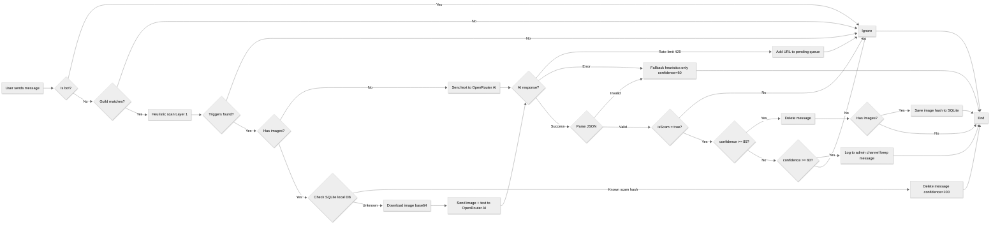

# AegisChat

Open-source Discord bot for real-time scam detection using hybrid analysis (heuristic rules + OpenRouter AI).

## Requirements

- [Bun](https://bun.sh) >= 1.0 installed
- A Discord Bot Token with **Message Content Intent** enabled
- An [OpenRouter](https://openrouter.ai) account

## Installation

```bash
git clone https://github.com/Ruimmp/AegisChat.git
cd AegisChat
bun install
```

## Configuration

1. Copy `.env.example` to `.env`
2. Fill in your values:

```env
# Discord
DISCORD_BOT_TOKEN=your_discord_bot_token_here
GUILD_ID=your_guild_id_here
LOG_CHANNEL_ID=your_log_channel_id_here

# OpenRouter (AI)
OPENROUTER_API_KEY=your_openrouter_api_key_here
OPENROUTER_MODEL=openrouter/free

# Detection thresholds
CONFIDENCE_THRESHOLD=85
REVIEW_THRESHOLD=60

# Logging
LOG_LEVEL=info
```

## Discord Bot Setup

1. Go to [Discord Developer Portal](https://discord.com/developers/applications)
2. Create a new application, then go to the "Bot" tab
3. Create a bot and copy the token
4. Enable **Message Content Intent** under the Bot tab
5. Invite the bot to your server with the following permissions:
   - **View Channels**
   - **Read Message History**
   - **Send Messages**
   - **Embed Links**
   - **Manage Messages**

## OpenRouter API Setup (Free)

1. Sign up at [openrouter.ai](https://openrouter.ai)
2. Go to Keys and generate an API key
3. Paste it into `.env` as `OPENROUTER_API_KEY`
4. Use `OPENROUTER_MODEL=openrouter/free` to automatically route to available free models that support the required features (text, image understanding, etc.). You can also use specific free models if preferred. See [OpenRouter Free Models](https://openrouter.ai/models?order=top_gpus&q=free) for options.

## How It Works

- **Layer 1 - Fast Filter**: Regex and heuristic detection for known scam patterns, suspicious URLs, new accounts, suspicious attachment behavior, and images.
- **Layer 2 - AI Analysis**: OpenRouter integration (free models) for contextual scam detection analyzing both text and images with confidence scoring.
- **Layer 3 - Action**:
  - Clear scams (high confidence + delete action): message is silently deleted.
  - Ambiguous scams (medium confidence): message is kept, but logged to the admin channel for manual review.



## Running the Bot

Development (with bun watch):

```bash
bun run dev
```

Production:

```bash
bun run start
```

## Confidence Thresholds

- `CONFIDENCE_THRESHOLD` (default: 85): Messages above this confidence with delete action are deleted automatically.
- `REVIEW_THRESHOLD` (default: 60): Messages between this and `CONFIDENCE_THRESHOLD` are logged to the admin channel for manual review but are NOT deleted.

## Logging

Set `LOG_LEVEL` in `.env` to control console output:

- `debug`: all logs
- `info`: info, warn, error (default)
- `warn`: warn, error only
- `error`: errors only

## Local Scam Image Database

To reduce API calls and avoid rate limits, AegisChat uses a local SQLite database with WAL mode for durability. The database stores:

- `scam_images`: SHA-256 hashes of confirmed scam images
- `pending_queue`: images waiting for AI analysis when rate-limited

**How it works:**

1. First time a new scam image is detected, the AI analyzes it and its hash is saved in SQLite.
2. Future messages with the same image are deleted immediately without calling the AI.
3. If OpenRouter is rate-limited, image URLs are queued in SQLite and retried every 5 minutes automatically.
4. Once the AI recovers and confirms a queued image as scam, it is added to the local database for instant future blocking.

Note: The SQLite database uses Bun's built-in `bun:sqlite` module. No extra dependencies are required.

## Project Structure

```
AegisChat/
├── aegis.db                    # Local SQLite database (scam hashes + pending queue)
├── .github/
│   └── workflows/
│       └── ci.yml
├── src/
│   ├── config/
│   │   └── index.js
│   ├── services/
│   │   ├── ai.service.js
│   │   ├── scamDetector.js
│   │   └── scamDatabase.js
│   ├── events/
│   │   └── messageCreate.js
│   ├── utils/
│   │   ├── imageDownloader.js
│   │   └── logger.js
│   └── index.js
├── .env.example
├── .gitignore
├── LICENSE
├── package.json
└── README.md
```

## Contributing

1. Fork the repository
2. Create a feature branch (`git checkout -b feature/my-feature`)
3. Commit your changes (`git commit -m 'Add my feature'`)
4. Run `bun run format` before committing
5. Push to the branch (`git push origin feature/my-feature`)
6. Open a Pull Request

## License

[MIT](LICENSE)
